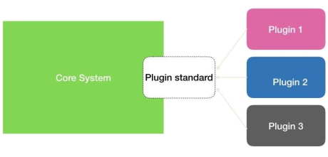
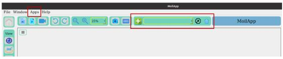
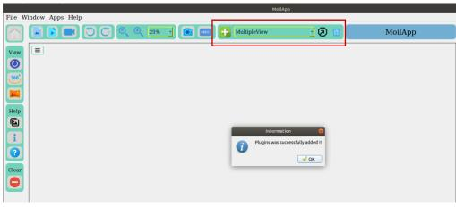
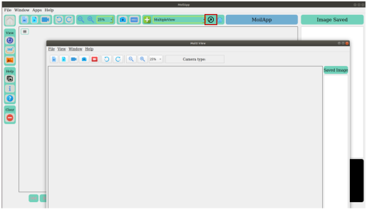

Plugin Extention
################

Add-ons (plugins) Application
=============================

Because the applications are very diverse, we implement a plugin framework so that users can select apps according to their needs. A plugin is a software component that adds a specific feature to an existing computer program. When a program supports plug-ins, it enables customization. A plugin architecture consists of two components: a core system and plug-in modules. The main key design here is to allow adding additional features that are called plugins modules to our core system, providing extensibility, flexibility, and isolation to our application features. This will provide us with the ability to add, remove, and change the behavior of the application with little or no effect on the core system or other plug-in modules making our code very modular and extensible.

The MoilApp application is designed to be able to implement this concept plugin, there is a special menu bar and button container to control the plug-in application as shown below.

Add plugins application
========================

You can add the application plugin that you have created by pressing the (+) button or menubar apps then select add application. System will open a file explorer dialog to select a plugin folder. If your application matches the format and was successfully added, then the plugin application will be available in the comboBox like shown on figure below

Open plugins application
========================

You can open a plugin that you have added by selecting it in the combo box and pressing the open plugins button. The example below is a multiple view plugin application for ADAS application.

Delete plugins application
==========================

If you want to delete the application plugins, you can do it by pressing the “delete” button in plugin controller container. This will open a dialog to confirm that you are sure to remove this app. If the application is deleted, then the application is no longer available in the application combo box list.

Note:
    - If you want to create your own plugin application, you can follow the tutorial in section 6.2.
    - Tutorial how to operate MoilApp can watch here: https://youtu.be/irpWmNmgAz4
    - Suppose you have any issue or want to contribute to this project, you can open issue in GitHub repository and you can ask for pull request.