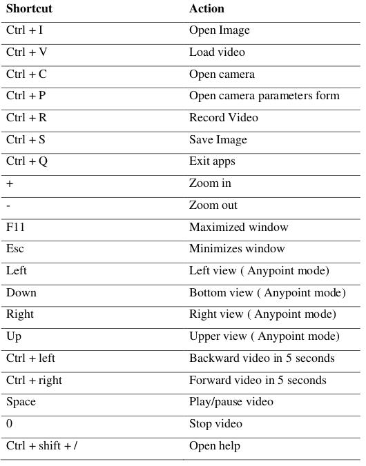

MoilApp Usage
#############

Operation of MoilApp
====================

In this session we will explain the components in the MoilApp application and tutorials on how to use the application.

Overview of The User Interface
==============================

When you open a project in PyCharm, the default user interface looks as follows:

.. image:: assets/overview-user.jpg
   :scale: 80 %
   :alt: alternate text
   :align: center

Here is detail explanation:
    1.  Menu bar

        This container stores various button

    a.  File

        File contains Load image, Load video, Open cam, Cam parameter, Record Video, Save Image, and Exit

    b.  Window

        Window contains Maximize and Minimize

    c.  Apps

        Apps contains Add, Open, Delete, Create and Help for Add-Ons

    d.  Help

        Help contains About Apps, About Us and Accessibility

    2.  Title application

        This part will give you information about the application name and information about image and video location as a source.

    3.  Source media button

        This grub contains three buttons: load image, load video and open camera. You can load images and videos from your directory and also can get images from your camera by streaming video. On open camera you can use USB Camera and streaming camera.

    4.  Rotate button

        Rotate image to the clockwise and anticlockwise direction.

    5.  Zoom button

        Make the image look bigger or smaller by zoom in and zoom out.

    6.  Saving button

        Save the resulting image or recording video in your local directory

    7.  Plugin controller

        The container Plugin controller contains several buttons that have functions to control plugins such as adding, opening and removing plugin application from the main application.

    8.  Information label

        Show the information of the camera type used.

    9.  Selection mode view

        This container contains several view mode selection buttons including original view, Anypoint view and panoramic view.

    10. Help button

        Contains several buttons that display information from this application such as manual guide, about us and about MoilApp.

    11. Clear media from widget

        This button will remove all objects such as pixmap images and others from the user interface to make the application look like it was just opened

    12. Extra button

        This button will be active when you select Anypoint or panorama view and help you to explore the image.

    13. Widget show result image

        This widget will be showing the result image after processing, this is the main image viewer on the user interface application.

    14. Widget to show Image saved

        Displaying images successfully saved which can then be reopened if your source media is video or camera.

    15. Video controller

        The video controller container contains several buttons and labels that function to control media such as start, pause, stop, forward, backward, time slider and duration label.

    16. Widget show original image

        This widget serves to display and maintain the original image to provide a reference regarding the process that occurs.

Open media source
=================

MoilApp provides various sources that can be used for processing, including image files, video files, and cameras both USB cams, web cams or streaming cams from raspberry-pi. You only need to press the button according to the media source that you will process and the app will open a file explorer dialog like shown below.

If you open a video file, you will be asked to choose the type of camera used at the combo box prompt after select file. This is useful for loading the camera parameters from the database.

To open the camera, there are options, namely usb cam and streaming cam. for USB cameras, you can detect the port to find out which port is used and then select it in the combo box, click button “oke” and you will be asked to choose the type of camera used at the combo box prompt. as shown in the image below

streaming cam option is to open camera from stream server URL which is usually used to access raspberry-pi camera. you only need to provide the URL of the camera and press button “oke” like the example below. you will be asked to choose the type of camera used at the combo box prompt.

If everything goes properly, the user interface will display the image as shown below.

For media from video and camera we provide controllers such as play, pause, stop, forward, backward and slider timer. where this controller can be used to facilitate image processing.

Open media source
=================

To improve the results of observations, sometimes we only want to see areas that have a lot of information. Therefore, we can use the undistortion rectilinear selected image method. This method is convert the image plane coordinate to hemispherical coordinates, move the optical axis to the specified zenithal (alpha) and azimuthal (beta) angle [refer to section 1.2].

Anypoint view has 2 modes, where mode 1 is the result rotation from betaOffset degree rotation around the Z-axis(roll) after alphaOffset degree rotation around the X-axis(pitch). Below is the example of Anypoint result mode-1.

Whereas, for mode -2 the result rotation is thetaY degree rotation around the Y- axis(yaw) after thetaX degree rotation around the X-axis(pitch). With the results of the image of this process can be seen in the following image.

When you are in Anypoint view mode, you can activate the help button which functions to change from mode 1 to mode 2 or vice versa. This help button also functions to see Anypoint result from a predetermined direction. Below is an overview of the extra button in Anypoint view mode

Process to panorama view
========================

As explained earlier, the panorama view may present a horizontal view in a specific immersed environment to meet the common human visual perception. The Figure below shows a diagram of transforming a fisheye image into a panoramic view.

.. image:: assets/diagram.jpg
   :scale: 100 %
   :alt: alternate text
   :align: center

The image below is the result of image processing panorama view.

You can also change the values of the maximum and minimum FoV via lineedit which will only appear in this mode. The overview of the line edit can be seen in the picture below:

Save image and record video
===========================

Save image
==========

You can save the original image or result image by pressing the save image button or by right clicking the mouse on the result image and selecting save image. at the first time you will save the image, application will open dialog to directed to choose the directory will use as storage.

Record video
============

If you want to record a video you can press the record button, the process is almost the same as saving an image. before starting recording, you will be directed to choose a directory and the video files will be saved in that folder.

Camera parameters
=================

Camera parameter is a very important component in fisheye image processing. Each fisheye camera can be calibrated and derives a set of parameters by MOIL laboratory before the successive functions can work correctly, configuration is necessary at the beginning of the program. MoilApp provides a form dialog that can add, modify, and delete parameters that will be stored in the database. To be able to use this feature, please click on File >> Camera Parameters. The overview of this form shown like picture below:

If you want to see the parameter, you can list the camera type from comboBox list parameter, and will display like figure below:

The following is the use of this feature in detail:

Add camera parameters
=====================

If you are using a camera whose parameters are not yet available in the database, you can add them. you just need to write all the parameters on the form, then click the "new" button. after that the data will be saved and you can use the camera parameters.

Modify camera parameters
========================

If you want to change the value of the parameter, you can modify it. select the camera type in the list parameter combobox, then you enter the new parameter value. click the update button and the modified parameters will be saved in the database.

Delete camera parameters
========================

You can also delete parameters by pressing the delete button on the selected parameter list.

Mouse event
===========

There are several functions of the mouse event that you can use to speed up work. The mouse event will only work on the result image and the original image of the user interface widget. Some of the mouse event's functions including

Mouse click event
=================

Mouse click event works only on the original image widget when Anypoint mode. This handy determine the coordinates of points that will be converted to alpha beta value. which then this value will be a parameter in converting the original image to Anypoint image.

Mouse press-move event
======================

The mouse press event has its own function in each image widget, in the origina image this widget works in Anypoint mode which allows for surrounding views. Different functions if you press the press-move mouse event on the result image widget, you can enlarge the area you are interested in using this function and its work in all mode view, for the example shown in the image below:

Double click event
==================

The Double click mouse event has function to reset Anypoint view to default in Anypoint mode.

Right click event
=================

If you right click on the mouse, it will display menu options like maximized, minimized, save image and show info.

Wheel event
============

wheel event will work by pressing the ctrl key simultaneously to zoom in and zoom out images on the user interface display

MoilApp keyboard shortcut
=========================

MoilApp has keyboard shortcuts for most of its commands related to processing and other tasks. Memorizing these hotkeys can help you stay more productive by keeping your hands on the keyboard. The following table lists some of the most useful shortcuts to learn:

